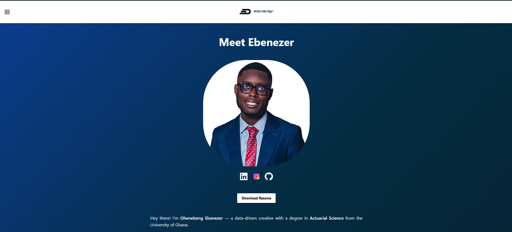

<!-- Profile README for @Ebenezer5542 -->

# Ebenezer Ohenebeng

**Data Scientist | Python & R | Survey Pipelines & Dashboards**

  
  
  
  

---

### 👋 About Me
I specialize in Python but also very proficient in R, Excel, SQL, Stata, among others: from wrangling messy data to building smart dashboards and automating systems that actually work. My mission? Turning raw data into powerful tools and intuitive insights.  

🎯 Interests: Data engineering for impact, RCT analytics, and clean information design 
🌍 Based in Accra; remote-friendly 
🧰 Tools: Python, R, SQL, Stata, Google Sheets, SurveyCTO, Power BI

---

### 🌐 My Website

---

### 🛠 Tech Stack

  
  
  
  
  
  
  
  

---

## 🚀 Featured Projects

<table>
<tr>
<td width="50%">

### Signin App

Staff log arrivals/departures. Checks location radius, validates IDs, records into Google Sheets.

</td>
<td width="50%">

### Time Estimate

Flask-based web app predicting estimated arrival times for Accra commuters.

</td>
</tr>
<tr>
<td width="50%">

### SurveyCTO Data Push

Tkinter desktop app to download SurveyCTO data and push to Google Sheets, manually or automatically.

</td>
<td width="50%">

### Portfolio Website

Personal portfolio to showcase projects and skills.

</td>
</tr>
</table>

---

## 📊 GitHub Stats

---

## 🤝 Let’s Connect

🌐 [Website](https://ohenebengebenezer.online/) 
💼 [LinkedIn](https://www.linkedin.com/in/ohenebeng-ebenezer-0190b421a) 
📧 ohenebengebenezer10@gmail.com  

> “The one colleagues run to when tech breaks.” — happy teammates

